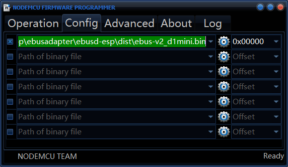

# ebusd-esp
Firmware for ESP8266 allowing eBUS communication for ebusd

## Flashing
First of all, you need to flash the firmware to the ESP board. Currently, only Wemos D1 mini boards are supported, but others might work as well.

In order to flash the firmware to the ESP board, you need a tool like [NodeMCU Flasher](https://nodemcu.readthedocs.io/en/master/en/flash/#nodemcu-flasher) or [esptool.py](https://nodemcu.readthedocs.io/en/master/en/flash/#esptoolpy).

Using that tool, simply flash the binary from the [dist folder](https://github.com/john30/ebusd-esp/tree/master/dist) to the board at address 0x0000.

For the NodeMCU Flasher, first pick the file and set the address to 0x0000:  


Then adjust the transfer settings:  


And finally, start the upload by pressing Flash:  


## Configuration
The firmware can be configured with a simple HTML frontend or by using the serial link, for Wemos D1 mini using the onboard USB serial converter.

### Configuration with serial link
Simply connect with e.g. Putty to the COM port after connecting the board to your computer and you will see the following configuration options:

```
Welcome to eBUS adapter 2.0, build 20171225
Configured as WIFI access point EBUS without password.
For configuration with web browser, connect to this WIFI and open http://192.168.4.1/
Entering configuration mode.
Chip ID: ********
CPU frequency: 80
Free heap: 37648
Hostname: ebus-******


Configuration (new):
 1. WIFI SSID: EBUS
 2. WIFI secret:
 3. WIFI IP address: DHCP
 4. ebusd TCP/UDP mode: TCP
 5. ebusd TCP port: 9999
 6. ebusd RX+TX PINs: direct RX+TX (GPIO3+1)
 7. Management TCP port: 80
 8. LED PINs: RX:disabled, TX:disabled
 9. Initial PIN direction: D4:H

 d. Set current PIN direction: D4:H
 t. Toggle current output PIN
 e. Dump EEPROM content
 f. Factory reset (F for hard reset)
 r. Reboot (without saving)
 0. Save configuration and reboot

Enter your choice: 
```

By entering one of the characters at the start of each configuration line and submitting by pressing ENTER, you can change the corresponding configuration item or initiate the action behind it.

Once you have entered the desired data and verified their correctness, press "0" for saving the configuration and rebooting the device.

### Configuration with HTML frontend
After flashing, the device acts as an WIFI access point with SSID "EBUS", no password, and IP address "192.168.4.1".

The management TCP port is setup by default for port 80 (HTTP). By entering the IP address of the device in a web browser, the main configuration settings can be changed similar to those of the serial link interface (not all options are available though):

[](http://129.168.4.1/)

Use "Check & Update" to check your input and if no error message appeared and after you have verified the correctness of the values, simply press "Save & Reset" to save the changes and reboot the device.


## Forced reset
If a factory reset is desired and cannot be initiated by serial connection, simply connect the Wemos pins D0 and 3V3 during boot and it will start in WIFI access point again with a blank configuration.


## LED
The onboard LED of the Wemos D1 Mini is used to give some feedback about the current state:
- After reset, it blinks two times slowly to inidicate it was (re-)started.
- When the WIFI connection was successfully established, it is switched on for around 10 seconds, until:
- When an ebusd instance has connected successfully to the TCP/UDP port and there is a steady eBUS signal, then the LED is turned on permanently.

If anything goes wrong during these steps, the LED will turn off. So everything is fine only if the LED is on permanently.
