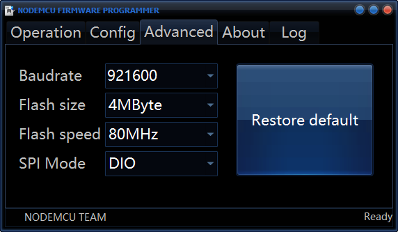
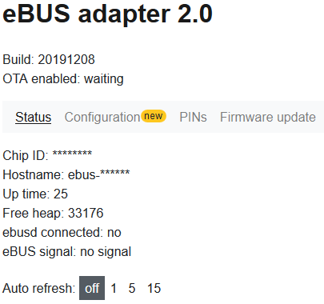
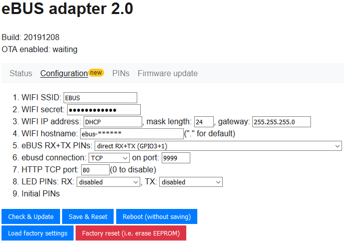

# ebusd-esp
Firmware for ESP8266 allowing eBUS communication for ebusd with lowest possible latency.

## History
For a history of version and changes made therein, see the [change log](Changelog.md).


## Flashing
First of all, you need to flash the firmware to the ESP board. Currently, only Wemos D1 mini boards are supported, but others might work as well.

In order to flash the firmware to the ESP board, you need a tool like [NodeMCU Flasher](https://nodemcu.readthedocs.io/en/master/en/flash/#nodemcu-flasher) or [esptool.py](https://nodemcu.readthedocs.io/en/master/en/flash/#esptoolpy).

Using that tool, simply flash the binary from the [dist folder](https://github.com/john30/ebusd-esp/tree/master/dist) to the board at address 0x0000.

For the NodeMCU Flasher, first pick the file and set the address to 0x0000:  


Then adjust the transfer settings:  


And finally, start the upload by pressing Flash:  


## Configuration
The firmware can be configured with a simple HTML frontend or by using the serial link, for Wemos D1 mini using the onboard USB serial converter.

### Configuration with serial link
Simply connect with e.g. Putty to the COM port at 115200 Baud (8N1) after connecting the board to your computer and you will see the following configuration options:

```
Welcome to eBUS adapter 2.0, build 20180922
Configured as WIFI access point EBUS without password.
For configuration with web browser, connect to this WIFI and open http://192.168.4.1/
Entering configuration mode.
Chip ID: ********
Hostname: ebus-******

Configuration (new):
 1. WIFI SSID: EBUS
 2. WIFI secret:
 3. WIFI IP address: DHCP (not connected)
 4. WIFI hostname: ebus-******
 5. ebusd connection: TCP on port 9999
 6. eBUS RX+TX PINs: direct RX+TX (GPIO3+1)
 7. HTTP TCP port: 80
 8. LED PINs: RX:disabled, TX:disabled
 9. Initial PIN direction: D4:H

 d. Set current PIN direction: D4:H
 t. Toggle current output PIN
 c. Connect WIFI
 e. Dump EEPROM content
 f. Load factory settings
 F. Factory reset (i.e. erase EEPROM)
 o. OTA active: starting
 r. Reboot (without saving)
 0. Save configuration and reboot

Enter your choice:
```

By entering one of the characters at the start of each configuration line and submitting by pressing ENTER, you can change the corresponding configuration item or initiate the action behind it.

Once you have entered the desired data and verified their correctness, press "0" for saving the configuration and rebooting the device.

### Configuration with HTML frontend
After flashing, the device acts as an WIFI access point with SSID "EBUS", no password, and IP address "192.168.4.1".

The HTTP TCP port is set to port 80 by default. By entering the IP address of the device in a web browser, a status page like this is shown:

[](http://192.168.4.1/)

The main configuration settings can be changed similarly to the serial link interface (not all options are available though) by clicking on [Configuration](http://192.168.4.1/config):

[](http://192.168.4.1/config)

Use "Check & Update" to check your input and if no error message appeared and after you have verified the correctness of the values, simply press "Save & Reset" to save the changes and reboot the device.

It is also possible to change PINs directly on the [PINs](http://192.168.4.1/pins) page:

[](http://192.168.4.1/pins)

If you want to change the initial PIN settings, just use the last column for that and afterwards go to the [Configuration](http://192.168.4.1/config) page and press "Save & Reset" to save the changes and reboot the device.


## LED
The onboard LED of the Wemos D1 Mini is used to give some feedback about the current state.

During reset, it usually blinks shortly as some data is sent on the Wemos debug output.

The LED status after the reset depends on the selected eBUS RX+TX PIN mode.

### LED in hardware UART (direct or swapped) and mixed RX + software D2 eBUS RX+TX PIN mode
When in one of these eBUS RX+TX PIN modes, the LED provides the following feedback:
- After reset, it blinks two times slowly to indicate it was (re-)started.
- While establishing the WIFI connection, it dims down from on several times up to 5 seconds.
- When the WIFI connection was successfully established, it is switched off for around 5 seconds.
  During that time (when no eBUS signal was detected), sending any key to the serial port makes the firmware go to serial configuration mode.
- When an ebusd instance has connected successfully to the TCP/UDP port and there is a steady eBUS signal, then the LED is turned on permanently either at full brightness (if ebusd regularly sends something to the eBUS) or less brightness (if ebusd does not write to the eBUS).

If anything goes wrong during these steps, the LED will turn off. So everything is fine only if the LED is on permanently at full or less brightness.

### LED in mixed software D1 + TX1 D4 eBUS RX+TX PIN mode
When the RX+TX PIN mode is set to mixed software D1 + TX1 D4 mode, the onboard LED will blink when something is sent actively from the Wemos on the eBUS only.


## PINs
If the HTTP port is configured, you can use the "/pin" URL for changing the value of an output PIN or read the current status of all PINs in JSON format.

E.g. in order to set D0 (GPIO16) to LOW, you could use the URL [http://192.168.4.1/pin?pin=0&mode=l](http://192.168.4.1/pin?pin=0&mode=l), and using [http://192.168.4.1/pin?pin=0&mode=h](http://192.168.4.1/pin?pin=0&mode=h) for HIGH.


## Firmware update

In order to update the firmware after the device was flashed initially as stated above, you can use the HTML frontend or the serial frontend for activating OTA.

Using the HTML frontend, you can also upload a new firmware directly after enabling OTA in the configuration page.